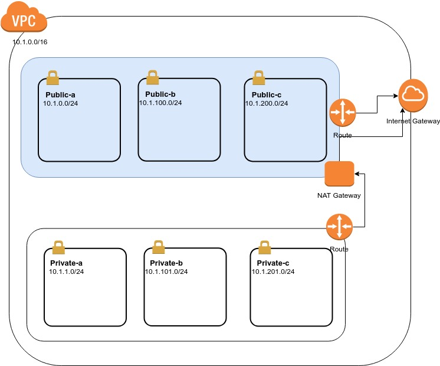

# Juice Shop Demo

## Introduction
This Juice shop is for demo how to use Ansible to create an application, so that the audience can understand Ansible features and limitations.
There is an advanced section to explain how to use Ansible as best practice

The juice shop app is a nodejs app from  [OWASP Juice shop](https://github.com/bkimminich/juice-shop.git) which original is for node application security training purpose

## Basic AWS structure

### Networks


#### VPC
There are three VPC included:
* DEV
* PROD
* PEER

#### Subnets
The demo Subnets for each VPCs name are
* `VPC_NAME`-public-`AZ_ZONE`
* `VPC_NAME`-private-`AZ_ZONE`

**Example**:
`PROD-public-a` is prod vpc public subnet in availability zone a

**Table of subnets**

**DEV**: `10.0.0.0/16`

| Name          | Range         |
| ------------- | ------------- |
| DEV-public-a  | 10.0.0.0/24   |
| DEV-public-b  | 10.0.100.0/24 |
| DEV-public-c  | 10.0.200.0/24 |
| DEV-private-a | 10.0.1.0/24   |
| DEV-private-b | 10.0.101.0/24 |
| DEV-private-c | 10.0.201.0/24 |


**PROD**: `10.1.0.0/16`

| Name           | Range         |
| -------------- | ------------- |
| PROD-public-a  | 10.1.0.0/24   |
| PROD-public-b  | 10.1.100.0/24 |
| PROD-public-c  | 10.1.200.0/24 |
| PROD-private-a | 10.1.1.0/24   |
| PROD-private-b | 10.1.101.0/24 |
| PROD-private-c | 10.1.201.0/24 |

**PEER**: `10.2.0.0/16`

| Name           | Range         |
| -------------- | ------------- |
| PEER-public-a  | 10.2.0.0/24   |
| PEER-public-b  | 10.2.100.0/24 |
| PEER-public-c  | 10.2.200.0/24 |
| PEER-private-a | 10.2.1.0/24   |
| PEER-private-b | 10.2.101.0/24 |
| PEER-private-c | 10.2.201.0/24 |

#### Route tables

| Destination | Target |
| ----------- | ------ |
| 10.1.0.0/16 | local  |
| 0.0.0.0/0   | IGW    |

## EC2

## Size
* t2.nano
## Security Groups

```
The port 22 is for remote ssh
```
**Ingress Rules**

| Name        | Ingress   | Port |
| ----------- | --------- | ---- |
| web-traffic | 0.0.0.0/0 | 22   |
| ssh-traffic | 0.0.0.0/0 | 80   |


**Egress Rules**

| Name    | Egress    | Port |
| ------- | --------- | ---- |
| all-all | 0.0.0.0/0 | all  |


## Application details

All setup are for demo purpose only, there is an advanced section to show some best practice for Ansible

### Basic app architecture

### OS

Ubuntu 16.04

### Packages
* git
* nginx
* nodejs

### App code
* [OWASP Juice shop](https://github.com/bkimminich/juice-shop.git)
### Setup
* Nginx Reverse proxy

## Ansible layout
```
juice-bar
    ├── ansible
    │   └── aws-infra
    │       ├── inventory-dev
    │       │   └── group_vars
    │       ├── inventory-peer
    │       │   └── group_vars
    │       ├── inventory-prod
    │       │   └── group_vars
    │       └── roles
    │           ├── aws-common
    │           ├── aws-igw
    │           ├── aws-instances
    │           ├── aws-route-tables
    │           ├── aws-security-groups
    │           ├── aws-subnets
    │           ├── aws-vpc
    │           └── aws-vpc-peering
    └── terraform
```
## Advanced

## Demo limitation


